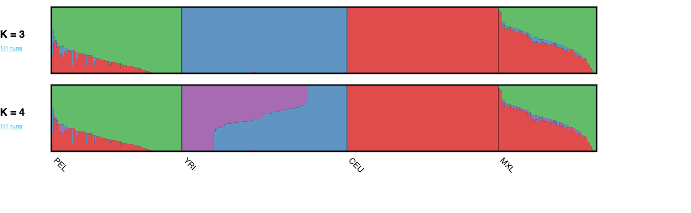

### 1. Running King to check for relatedness between individuals

```bash
module load king
king -b nama_tgp_qc.bed --ibdseg --cpus 15 --prefix nama_tgp_qc

king -b nama_tgp_qc.bed --ibs --cpus 15 --prefix nama_tgp_qc

KING starts at Tue Dec 29 14:39:18 2020
Loading genotype data in PLINK binary format...
Read in PLINK fam file nama_tgp_qc.fam...
  PLINK pedigrees loaded: 395 samples
Read in PLINK bim file nama_tgp_qc.bim...

  Genotype data consist of 1721935 autosome SNPs
  PLINK maps loaded: 1721935 SNPs
Read in PLINK bed file nama_tgp_qc.bed...
  PLINK binary genotypes loaded.
  KING format genotype data successfully converted.
Autosome genotypes stored in 26906 words for each of 395 individuals.

Options in effect:
        --ibs
        --cpus 15
        --prefix nama_tgp_qc

Total length of chromosomal segments usable for IBD segment analysis is 2668.7 MB
  Information of these chromosomal segments can be found in file nama_tgp_qcallsegs.txt

Within-family IBS data saved in file nama_tgp_qc.ibs

Relationship summary (total relatives: 0 by pedigree, 798 by inference)
  Source        MZ      PO      FS      2nd     3rd     OTHER
  ===========================================================
  Pedigree      0       0       0       0       0       5151
  Inference     0       33      3       366     396     4353

IBS and relationship inference across families starts at Tue Dec 29 14:39:28 2020
15 CPU cores are used.
                                         ends at Tue Dec 29 14:39:31 2020
Between-family IBS data saved in file nama_tgp_qc.ibs0
```

To solve the issue with the chromosomes all looking like the same color because of relatedness in the namas:

### 1. Create new plink files with only the reference individuals.
```
plink --bfile nama_tgp_qc_pops --keep reference.keep --make-bed --out ref_samples
```
### 2. Run king on reference plink files to check for relatedness
```
module load king
king -b ref_samples.bed --ibdseg --cpus 15 --prefix ref_samples_king
king -b ref_samples.bed --ibs --cpus 15 --prefix ref_samples_king
king -b ref_samples.bed --related --cpus 15 --prefix ref_samples_king
king -b ref_samples.bed --unrelated --degree 2
king -b ref_samples.bed --unrelated --degree 3
```

```
Family clustering starts at Tue Jan  5 11:37:51 2021
Autosome genotypes stored in 26906 words for each of 337 individuals.
Sorting autosomes...
Total length of chromosomal segments usable for IBD segment analysis is 2668.7 MB
  Information of these chromosomal segments can be found in file kingallsegs.txt

32 CPU cores are used to compute the pairwise kinship coefficients...
Clustering up to 2nd-degree relatives in families...
Individual IDs are unique across all families.
No families were found to be connected.

A list of 302 unrelated individuals saved in file kingunrelated.txt
An alternative list of 35 to-be-removed individuals saved in file kingunrelated_toberemoved.txt

Extracting a subset of unrelated individuals ends at Tue Jan  5 11:38:02 2021
```

### 3. Keep the unrelated individuals in the reference population

```
plink --bfile ref_samples --keep kingunrelated.txt --make-bed --out ref_unrelated
```


### 4. Combine with CDB data

```
plink --bfile ref_unrelated --bmerge /share/hennlab/data/snp-array/SAfrica_IlluminaArrays/CDB_NCTB_H3Africa/CDB/SNP-QC/cdb_80.bed /share/hennlab/data/snp-array/SAfrica_IlluminaArrays/CDB_NCTB_H3Africa/CDB/SNP-QC/cdb_80.bim /share/hennlab/data/snp-array/SAfrica_IlluminaArrays/CDB_NCTB_H3Africa/CDB/SNP-QC/cdb_80.fam --make-bed --out ref_CDB_merge

cut -f2 ref_CDB_merge.bim | wc -l # 3245933 overlapping SNPs

plink --bfile ref_CDB_merge --geno 0.05 --make-bed --out ref_CDB_merge_geno0.05
cut -f2 ref_CDB_merge_geno0.05.bim | wc -l
```
After removing relatives,
85 LWK, 88 GBR, 103 CHB and 26 NAMA

SA2002,SA2076,SA2088 need to be removed from Namas, but otherwise we will use all of the reference NAMA and 50 of each population in the reference set.

Taking first 50 of each population from the `kingunrelated.txt` file, and all the Namas minus SA2002,SA2076,SA2088.

```
grep "CHB" kingunrelated.txt | head -n 50 > balanced_ref_unrelated_smps.txt
grep "GBR" kingunrelated.txt | head -n 50 >> balanced_ref_unrelated_smps.txt
grep "LWK" kingunrelated.txt | head -n 50 >> balanced_ref_unrelated_smps.txt
grep "NAMA" kingunrelated.txt >> balanced_ref_unrelated_smps.txt
grep "NAMA" kingunrelated_toberemoved.txt >> balanced_ref_unrelated_smps.txt
# manually delete SA2002,SA2076,SA2088 with vim
```

Keep new balanced reference samples
```
plink --bfile ref_samples --keep balanced_ref_unrelated_smps.txt --make-bed --out ref_balanced_unrelated
```

Combine with CDB data
```
# first add population to FID column
awk '{print "CDB"" "$2" "$3" "$4" "$5" "$6}' /share/hennlab/data/snp-array/SAfrica_IlluminaArrays/CDB_NCTB_H3Africa/CDB/SNP-QC/cdb_80.fam > cdb_80_pops.fam

plink --bfile ref_balanced_unrelated --bmerge cdb_80_pops.bed cdb_80_pops.bim cdb_80_pops.fam --make-bed --out ref_bal_CDB_merge
```

Check overlapping SNPs
```
cut -f2 ref_bal_CDB_merge.bim | wc -l # 3245933 SNPs
plink --bfile ref_bal_CDB_merge --geno 0.05 --make-bed --out ref_bal_CDB_merge_geno0.05 # 435582 SNPs
```

Check PCA
```
plink --bfile ref_bal_CDB_merge_geno0.05 --pca 4 --out ref_bal_CDB_merge_geno0.05
```
PCA looks as expected. proceeding with running as-ibdne.


### 5. Run as-ibdne on the new dataset

```
sed 's/\t/ /g' balanced_ref_unrelated_smps.txt > balanced_ref_unrelated_smps.ref.keep
cut -f2 cdb_80_pops.fam > cdb_admix.keep
```

config file
```yaml
gmap: /share/hennlab/reference/recombination_maps/genetic_map_HapMapII_GRCh37/

dataset: ref_bal_CDB_merge_geno0.05

ref: /share/hennlab/reference/1000G_Phase3_haps-sample-legend/1000GP_Phase3/1000GP_Phase3

ids_ref: data/balanced_ref_unrelated_smps.ref.keep

ids_admix: data/cdb_admix.keep

pops: data/cdb_merge_pops.txt
```

Run snakemake

```bash
/share/hennlab/progs/miniconda3/bin/snakemake --configfile config/config_ref_CDB_merge.yaml -j 20


```

/share/hennlab/progs/miniconda3/bin/snakemake --configfile config/config_ref_CDB_merge.yaml -j 20 --rulegraph | dot -Tpng > rulegraph.png

Check on karyograms
```
python scripts/collapse_ancestry.py \
--rfmix results/RFMIX/ref_bal_CDB_merge_geno0.05.chr1.rfmix.2.Viterbi.txt \
--snp_locations results/RFMIX/ref_bal_CDB_merge_geno0.05_chr1.snp_locations \
--fbk results/RFMIX/ref_bal_CDB_merge_geno0.05.chr1.rfmix.2.ForwardBackward.txt \
--fbk_threshold 0.9 \
--ind SA3097 \
--ind_info results/RFMIX/ref_bal_CDB_merge_geno0.05.sample \
--pop_labels GBR,CHB,LWK,NAMA \
--out SA3097
```

python scripts/plot_karyogram.py \
--bed_a SA3097_A.bed \
--bed_b SA3097_B.bed \
--ind SA3097 \
--pop_order GBR,CHB,LWK,NAMA \
--out SA3097.png

## Plot 6 karyograms for CDB and send to Austin & Brenna

SA3107, SA3140, SA3154, SA3124, SA3089, SA3097

SA3060 SA3188 SA3164

### Testing step 7 script

## implementing new rfmix version 2.3

./rfmix -f <query VCF/BCF file>
	-r <reference VCF/BCF file>
	-m <sample map file>
	-g <genetic map file>
	-o <output basename>
	--chromosome=<chromosome to analyze>


python scripts/RunRFMix.py -e 2 -w 0.2 --num-threads {threads} --use-reference-panels-in-EM --forward-backward PopPhased {input.all} {input.cl} {input.snp} -o {params}


Trying to figure out why RFmix was rerun and what changed between the good runs and bad runs:

cut -d" " -f2 balanced_ref_unrelated_smps.ref.keep > reference.samples.keep
cut -d" " -f2 cdb_admix.keep > admix.samples.keep
python ../scripts/shapeit2rfmix.py --shapeit_hap_ref ref_bal_CDB_merge_geno0.05.chr10.phased.haps --shapeit_hap_admixed ref_bal_CDB_merge_geno0.05.chr10.phased.haps --shapeit_sample_ref ref_bal_CDB_merge_geno0.05.chr10.phased.sample --shapeit_sample_admixed ref_bal_CDB_merge_geno0.05.chr10.phased.sample --ref_keep reference.samples.keep  --admixed_keep admix.samples.keep --chr 10 --genetic_map /share/hennlab/reference/recombination_maps/genetic_map_HapMapII_GRCh37/chr10.gmap.txt --out script_out


Looks like the list of ref pops included CDB
problem run fix classes rule inputs (less 2021-01-19T160309.758281.snakemake.log) : results/RFMIX/ref_bal_CDB_merge_geno0.05.GBR.keep, results/RFMIX/ref_bal_CDB_merge_geno0.05.CHB.keep, results/RFMIX/ref_bal_CDB_merge_geno0.05.LWK.keep, results/RFMIX/ref_bal_CDB_merge_geno0.05.NAMA.keep, results/RFMIX/ref_bal_CDB_merge_geno0.05.
CDB.keep, results/RFMIX/ref_bal_CDB_merge_geno0.05.sample

fix classes rule inputs for the run that worked: results/RFMIX/nama_tgp_qc_pops.GBR.keep, results/RFMIX/nama_tgp_qc_pops.CHB.keep, results/RFMIX/nama_tgp_qc_pops.LWK.keep, results/RFMIX/nama_tgp_qc_pops.NAMA.keep, results/RFMIX/nama_tgp_qc_pops.sample

python ../scripts/classes.py --ref ref_bal_CDB_merge_geno0.05.GBR.keep,ref_bal_CDB_merge_geno0.05.CHB.keep,ref_bal_CDB_merge_geno0.05.LWK.keep,ref_bal_CDB_merge_geno0.05.NAMA.keep --sample ref_bal_CDB_merge_geno0.05.sample --out new_fix.classes


When the good version of rfmix was run, it used this file results/RFMIX/new.classes , which looks like
```
1 1 1 1 1 1 1 1 1 1 1 1 1 1 1 1 1 1 1 1 1 1 1 1 1 1 1 1 1 1 1 1 1 1 1 1 1 1 1 1 1 1 1 1 1 1 1 1 1 1 1 1 1 1 1 1 1 1 1 1 1 1 1 1 1 1 1 1 1 1 1 1 1 1 1 1 1 1 1 1 1 1 1 1 1 1 1 1 1 1 1 1 1 1 1 1 1 1 1 1 1 1 1 1 1 1 1 1 1 1 1 1 1 1 1 1 1 1 1 1 1 1 1 1 1 1 1 1 1 1 1 1 1 1 1 1 1 1 1 1 1 1 1 1 1 1 1 1 1 1 1 1 1 1 1 1 1 1 1 1 1 1 1 1 1 1 1 1 1 1 1 1 1 1 1 1 1 1 1 1 1 1 2 2 2 2 2 2 2 2 2 2 2 2 2 2 2 2 2 2 2 2 2 2 2 2 2 2 2 2 2 2 2 2 2 2 2 2 2 2 2 2 2 2 2 2 2 2 2 2 2 2 2 2 2 2 2 2 2 2 2 2 2 2 2 2 2 2 2 2 2 2 2 2 2 2 2 2 2 2 2 2 2 2 2 2 2 2 2 2 2 2 2 2 2 2 2 2 2 2 2 2 2 2 2 2 2 2 2 2 2 2 2 2 2 2 2 2 2 2 2 2 2 2 2 2 2 2 2 2 2 2 2 2 2 2 2 2 2 2 2 2 2 2 2 2 2 2 2 2 2 2 2 2 2 2 2 2 2 2 2 2 2 2 2 2 2 2 2 2 2 2 2 2 2 2 2 2 2 2 2 2 2 2 2 2 2 2 2 2 2 2 2 2 2 2 2 2 2 2 2 2 2 2 2 2 2 2 3 3 3 3 3 3 3 3 3 3 3 3 3 3 3 3 3 3 3 3 3 3 3 3 3 3 3 3 3 3 3 3 3 3 3 3 3 3 3 3 3 3 3 3 3 3 3 3 3 3 3 3 3 3 3 3 3 3 3 3 3 3 3 3 3 3 3 3 3 3 3 3 3 3 3 3 3 3 3 3 3 3 3 3 3 3 3 3 3 3 3 3 3 3 3 3 3 3 3 3 3 3 3 3 3 3 3 3 3 3 3 3 3 3 3 3 3 3 3 3 3 3 3 3 3 3 3 3 3 3 3 3 3 3 3 3 3 3 3 3 3 3 3 3 3 3 3 3 3 3 3 3 3 3 3 3 3 3 3 3 3 3 3 3 3 3 3 3 3 3 3 3 3 3 3 3 3 3 3 3 3 3 3 3 3 3 3 3 3 3 3 3 3 3 3 3 3 3 0 0 0 0 0 0 4 4 4 4 4 4 0 0 0 0 0 0 4 4 4 4 0 0 0 0 4 4 0 0 4 4 0 0 4 4 0 0 4 4 4 4 4 4 4 4 4 4 4 4 4 4 4 4 0 0 4 4 4 4 4 4 0 0 0 0 0 0 4 4 4 4 0 0 0 0 4 4 4 4 4 4 0 0 4 4 0 0 4 4 4 4 4 4 4 4 4 4 0 0 0 0 0 0 0 0 0 0 0 0 4 4 0 0 0 0 4 4 0 0 4 4 4 4 0 0 0 0 0 0 4 4 0 0 0 0 0 0 4 4 0 0 4 4 0 0 0 0 0 0 0 0 0 0 4 4 4 4 4 4 4 4 4 4 4 4 0 0 0 0 0 0 4 4 0 0 0 0 0 0 0 0 0 0 0 0 0 0 0 0 0 0 0 0 0 0 0 0 0 0 0 0 0 0
```

while the file output by the classes.py script looks like this
```
2 2 2 2 2 2 2 2 2 2 2 2 2 2 2 2 2 2 2 2 2 2 2 2 2 2 2 2 2 2 2 2 2 2 2 2 2 2 2 2 2 2 2 2 2 2 2 2 2 2 2 2 2 2 2 2 2 2 2 2 2 2 2 2 2 2 2 2 2 2 2 2 2 2 2 2 2 2 2 2 2 2 2 2 2 2 2 2 2 2 2 2 2 2 2 2 2 2 2 2 1 1 1 1 1 1 1 1 1 1 1 1 1 1 1 1 1 1 1 1 1 1 1 1 1 1 1 1 1 1 1 1 1 1 1 1 1 1 1 1 1 1 1 1 1 1 1 1 1 1 1 1 1 1 1 1 1 1 1 1 1 1 1 1 1 1 1 1 1 1 1 1 1 1 1 1 1 1 1 1 1 1 1 1 1 1 1 1 1 1 1 1 1 1 1 1 1 1 1 1 3 3 3 3 3 3 3 3 3 3 3 3 3 3 3 3 3 3 3 3 3 3 3 3 3 3 3 3 3 3 3 3 3 3 3 3 3 3 3 3 3 3 3 3 3 3 3 3 3 3 3 3 3 3 3 3 3 3 3 3 3 3 3 3 3 3 3 3 3 3 3 3 3 3 3 3 3 3 3 3 3 3 3 3 3 3 3 3 3 3 3 3 3 3 3 3 3 3 3 3 4 4 4 4 4 4 4 4 4 4 4 4 4 4 4 4 4 4 4 4 4 4 4 4 4 4 4 4 4 4 4 4 4 4 4 4 4 4 4 4 4 4 4 4 4 4 4 4 4 4 4 4 4 4 4 4 4 4 4 4 4 4 4 4 4 4 4 4 4 4 4 4 4 4 4 4 4 4 4 4 4 4 0 0 0 0 0 0 0 0 0 0 0 0 0 0 0 0 0 0 0 0 0 0 0 0 0 0 0 0 0 0 0 0 0 0 0 0 0 0 0 0 0 0 0 0 0 0 0 0 0 0 0 0 0 0 0 0 0 0 0 0 0 0 0 0 0 0 0 0 0 0 0 0 0 0 0 0 0 0 0 0 0 0 0 0 0 0 0 0 0 0 0 0 0 0 0 0 0 0 0 0 0 0 0 0 0 0 0 0 0 0 0 0 0 0 0 0 0 0 0 0 0 0 0 0 0 0 0 0 0 0 0 0 0 0 0 0 0 0 0 0 0 0 0 0 0 0 0 0 0 0 0 0 0 0 0 0 0 0 0 0 0 0 0 0 0 0 0 0 0 0 0 0 0 0 0 0 0 0 0 0 0 0 0 0 0 0 0 0 0 0 0 0 0 0 0 0 0 0 0 0 0 0 0 0 0 0 0 0 0 0 0 0 0 0 0 0 0 0 0 0 0 0 0 0 0 0 0 0 0 0 0 0 0 0 0 0 0 0 0 0 0 0 0 0 0 0 0 0 0 0 0 0 0 0 0 0 0 0 0 0 0 0 0 0 0 0 0 0 0 0 0 0 0 0 0 0 0 0 0 0 0 0 0 0 0 0 0 0 0 0 0 0 0 0 0 0 0 0 0 0 0 0 0 0 0 0 0 0 0 0 0 0 0 0 0 0 0 0 0 0 0 0 0 0 0 0 0 0 0 0 0 0 0 0 0 0 0 0 0 0 0 0 0 0 0 0 0 0 0 0 0 0 0 0 0 0 0 0 0 0 0 0 0 0 0 0 0 0 0 0 0 0 0 0 0 0 0 0 0 0 0 0 0 0 0 0 0 0 0 0 0 0 0 0 0 0 0 0 0 0 0 0 0 0 0 0 0 0 0 0 0 0 0 0 0 0 0 0 0 0 0 0 0 0 0 0 0 0 0 0 0 0 0 0 0 0 0 0 0 0 0 0 0 0 0 0 0 0 0 0 0 0 0 0 0 0 0 0 0 0 0 0 0 0 0 0 0 0 0 0 0 0 0 0 0 0 0 0 0 0 0 0 0 0 0 0 0 0 0 0 0 0 0 0 0 0 0 0 0 0 0 0 0 0 0 0 0 0 0 0 0 0 0 0 0 0 0 0 0 0 0 0 0 0 0 0 0 0 0 0 0 0 0 0 0 0 0 0 0 0 0 0 0 0 0 0 0 0 0 0 0 0 0 0 0 0 0 0 0 0 0 0 0 0 0 0 0 0 0 0 0 0 0 0 0 0 0 0 0 0 0 0 0 0 0 0 0 0 0 0 0 0 0 0 0 0 0 0 0 0 0 0 0 0 0 0 0 0 0 0 0 0 0 0 0 0 0 0 0 0 0 0 0 0 0 0 0 0 0 0 0 0 0 0 0 0 0 0 0 0 0 0 0 0 0 0 0 0 0 0 0 0 0 0 0 0 0 0 0 0 0 0 0 0 0 0 0 0 0 0 0 0 0 0 0 0 0 0 0 0 0 0 0 0 0 0 0 0 0 0 0 0 0 0 0 0 0 0 0 0 0 0 0 0 0 0 0 0 0 0 0 0 0 0 0 0 0 0 0 0 0 0 0 0 0 0 0 0 0 0 0 0 0 0 0 0 0 0 0 0 0 0 0 0 0 0 0 0 0 0 0 0 0 0 0 0 0 0 0 0 0 0 0 0 0 0 0 0 0 0 0 0 0 0 0 0 0 0 0 0 0 0 0 0 0 0 0 0 0 0 0 0 0 0 0 0 0 0 0 0 0 0 0 0 0 0 0 0 0 0 0 0 0 0 0 0 0 0 0 0 0 0 0 0 0 0 0 0 0 0 0 0 0 0 0 0 0 0 0 0 0 0 0 0 0 0 0 0
```
the old new.classes file was leftover from the previous run where  

python ../scripts/classes.py --ref ref_bal_CDB_merge_geno0.05.GBR.keep,ref_bal_CDB_merge_geno0.05.CHB.keep,ref_bal_CDB_merge_geno0.05.LWK.keep,ref_bal_CDB_merge_geno0.05.NAMA.keep --sample new_tail.sample --out new_tail_fix.classes


Testing running rfmix on dataset with classes file size 2

rule run_rfmix:
    input: results/RFMIX/ref_bal_CDB_merge_geno0.05_chr1.alleles, results/RFMIX/ref_bal_CDB_merge_geno0.05_chr1.snp_locations, results/RFMIX/new.classes
    output: results/RFMIX/ref_bal_CDB_merge_geno0.05.chr1.rfmix.0.ForwardBackward.txt, results/RFMIX/ref_bal_CDB_merge_geno0.05.chr1.rfmix.1.ForwardBackward.txt, results/RFMIX/ref_bal_CDB_merge_geno0.05.chr1.rfmix.2.ForwardBackward.txt, results/RFMIX/ref_bal_CDB_merge_geno0.05.chr1.rfmix.0.Viterbi.txt, results/RFMIX/ref_bal_CDB_merge_geno0.05.chr1.rfmix.1.Viterbi.txt, results/RFMIX/ref_bal_CDB_merge_geno0.05.chr1.rfmix.2.Viterbi.txt, results/RFMIX/ref_bal_CDB_merge_geno0.05.chr1.rfmix.allelesRephased0.txt, results/RFMIX/ref_bal_CDB_merge_geno0.05.chr1.rfmix.allelesRephased1.txt, results/RFMIX/ref_bal_CDB_merge_geno0.05.chr1.rfmix.allelesRephased2.txt
    jobid: 1
    wildcards: dataset=ref_bal_CDB_merge_geno0.05, chrnum=1
    threads: 10

running in snakemake screen

python RunRFMix.py -e 2 -w 0.2 --num-threads 20 --use-reference-panels-in-EM --forward-backward PopPhased results/RFMIX/ref_bal_CDB_merge_geno0.05_chr1.alleles debugging/small.classes results/RFMIX/ref_bal_CDB_merge_geno0.05_chr1.snp_locations -o debugging/small_classes_file_test

Also, run admixture plot for our data with K =4


## March 4th 2021

Troubleshooting the all purple- Nama results

Pulling out the Nama, and phasing with 1000 genomes to see if it has similar misaligned snps

```
cd /share/hennlab/projects/IBDNe/as-ibdne/dataset
# pulling out the NAMA reference individual IDs
grep "NAMA" balanced_ref_unrelated_smps.ref.keep > NAMA_ref_inds.txt
# Creating Nama only reference dataset
plink --bfile ref_bal_CDB_merge_geno0.05 --keep NAMA_ref_inds.txt --make-bed --out NAMA_ref_only

# Phasing with shapeit
/share/hennlab/projects/IBDNe/as-ibdne/debugging

for chr in `seq 1 22` ; do plink --bfile ../dataset/NAMA_ref_only --chr $chr --make-bed --out NAMA_ref_only_chr${chr}; done

for chr in `seq 1 22`; do shapeit -B NAMA_ref_only_chr${chr} -M /share/hennlab/reference/recombination_maps/genetic_map_HapMapII_GRCh37/chr${chr}.gmap.txt --input-ref /share/hennlab/reference/1000G_Phase3_haps-sample-legend/1000GP_Phase3/1000GP_Phase3_chr${chr}.hap.gz /share/hennlab/reference/1000G_Phase3_haps-sample-legend/1000GP_Phase3/1000GP_Phase3_chr${chr}.legend.gz /share/hennlab/reference/1000G_Phase3_haps-sample-legend/1000GP_Phase3/1000GP_Phase3.sample --duohmm -W 5 -O NAMA_ref_only_phased_chr${chr} --output-log NAMA_ref_only_phased_chr${chr} -T 10; done
```

It ran fine on the Nama.


#### Throwing out 9k SNPs from the combined dataset and rerunning

- remove these snps from the admixed dataset, then combine with the reference dataset and rephase.

Script:
```
INPUT=$1
MAP=$2
LOG=$3
OUTPUT=$4
REF_HAP=$5
REF_LEG=$6
REF_SAMP=$7
THREADS=$8

shapeit -B ${INPUT} -M ${MAP} --input-ref ${REF_HAP} ${REF_LEG} ${REF_SAMP} --duohmm -W 5 -O ${OUTPUT} --output-log ${LOG}.log -T ${THREADS}

grep Missing ${LOG}.snp.strand | cut -f4 > ${INPUT}_missing_from_ref.txt
grep Strand ${LOG}.snp.strand | awk '$11==1 {print $4}' > ${INPUT}_flip_in_dataset.txt
grep Strand ${LOG}.snp.strand | awk '$11==0 {print $4}' > ${INPUT}_cannot_flip_in_dataset.txt

cat ${INPUT}_missing_from_ref.txt ${INPUT}_flip_in_dataset.txt ${INPUT}_cannot_flip_in_dataset.txt > ${INPUT}_remove_from_dataset.txt
plink --bfile ${INPUT} --exclude ${INPUT}_remove_from_dataset.txt --make-bed --out ${INPUT}_misalign_removed

plink --bfile ${INPUT}_misalign_removed --bmerge /share/hennlab/projects/IBDNe/as-ibdne/version_2.3/data/cdb_nama_0.05.ref.bed /share/hennlab/projects/IBDNe/as-ibdne/version_2.3/data/cdb_nama_0.05.ref.bim /share/hennlab/projects/IBDNe/as-ibdne/version_2.3/data/cdb_nama_0.05.ref.fam --make-bed --out /share/hennlab/projects/IBDNe/as-ibdne/remove_9k_snps/cdb_ref_merge_snpremove
```

Running the script in /share/hennlab/projects/IBDNe/as-ibdne/remove_9k_snps to remove snps then recombine.
```
for chr in `seq 1 22` ; do nice scripts/shapeit_iterate.sh results/phasing/cdb_nama_0.05.admix.chr${chr} /share/hennlab/reference/recombination_maps/genetic_map_HapMapII_GRCh37/ shapeit_log/cdb_nama_0.05.admix_chr${chr}.phased results/phasing/cdb_nama_0.05.admix.chr${chr}.phased /share/hennlab/reference/1000G_Phase3_haps-sample-legend/1000GP_Phase3/1000GP_Phase3_chr${chr}.hap.gz /share/hennlab/reference/1000G_Phase3_haps-sample-legend/1000GP_Phase3/1000GP_Phase3_chr${chr}.legend.gz /share/hennlab/reference/1000G_Phase3_haps-sample-legend/1000GP_Phase3/1000GP_Phase3.sample 35 ; done
```


```
plink --bfile cdb_ref_merge_snpremove --geno 0.05 --mind 0.1 --make-bed --out cdb_ref_merge_snpremove_qc

Logging to cdb_ref_merge_snpremove_qc.log.
Options in effect:
  --bfile cdb_ref_merge_snpremove
  --geno 0.05
  --make-bed
  --mind 0.1
  --out cdb_ref_merge_snpremove_qc

257931 MB RAM detected; reserving 128965 MB for main workspace.
1738916 variants loaded from .bim file.
726 people (12 males, 14 females, 700 ambiguous) loaded from .fam.
Ambiguous sex IDs written to cdb_ref_merge_snpremove_qc.nosex .
424 people removed due to missing genotype data (--mind).
IDs written to cdb_ref_merge_snpremove_qc.irem .
Using 1 thread (no multithreaded calculations invoked).
Before main variant filters, 302 founders and 0 nonfounders present.
Calculating allele frequencies... done.
Total genotyping rate in remaining samples is 0.990008.
17004 variants removed due to missing genotype data (--geno).
1721912 variants and 302 people pass filters and QC.
Note: No phenotypes present.
--make-bed to cdb_ref_merge_snpremove_qc.bed + cdb_ref_merge_snpremove_qc.bim +
cdb_ref_merge_snpremove_qc.fam ... done.

removed all of the cederberg samples.
```
rerun the simple test on this dataset
```
nice /share/hennlab/progs/miniconda3/bin/snakemake --configfile cdb_ref_merge_snpremove.yaml -j 20 -n
```
remove snps
```
miramastoras@augrabies:/share/hennlab/projects/IBDNe/as-ibdne/remove_9k_snps/results/phasing$ wc -l *remove_from_dataset.txt
   6004 cdb_nama_0.05.admix.chr10_remove_from_dataset.txt
   6315 cdb_nama_0.05.admix.chr11_remove_from_dataset.txt
   6141 cdb_nama_0.05.admix.chr12_remove_from_dataset.txt
   3809 cdb_nama_0.05.admix.chr13_remove_from_dataset.txt
   3861 cdb_nama_0.05.admix.chr14_remove_from_dataset.txt
   3912 cdb_nama_0.05.admix.chr15_remove_from_dataset.txt
   4261 cdb_nama_0.05.admix.chr16_remove_from_dataset.txt
   4035 cdb_nama_0.05.admix.chr17_remove_from_dataset.txt
   3057 cdb_nama_0.05.admix.chr18_remove_from_dataset.txt
   3716 cdb_nama_0.05.admix.chr19_remove_from_dataset.txt
   9649 cdb_nama_0.05.admix.chr1_remove_from_dataset.txt
   2463 cdb_nama_0.05.admix.chr20_remove_from_dataset.txt
   1569 cdb_nama_0.05.admix.chr21_remove_from_dataset.txt
   1730 cdb_nama_0.05.admix.chr22_remove_from_dataset.txt
   9741 cdb_nama_0.05.admix.chr2_remove_from_dataset.txt
   9007 cdb_nama_0.05.admix.chr3_remove_from_dataset.txt
   8480 cdb_nama_0.05.admix.chr4_remove_from_dataset.txt
   7603 cdb_nama_0.05.admix.chr5_remove_from_dataset.txt
   9171 cdb_nama_0.05.admix.chr6_remove_from_dataset.txt
   7444 cdb_nama_0.05.admix.chr7_remove_from_dataset.txt
   6194 cdb_nama_0.05.admix.chr8_remove_from_dataset.txt
   5420 cdb_nama_0.05.admix.chr9_remove_from_dataset.txt
 123582 total
```

### Pulling out original 1000 genomes individuals and recombining with the NAma

/share/genomes/1000genomes/phase3

```
for chr in `seq 1 22`; do plink --vcf /share/genomes/1000genomes/phase3/ALL.chr${chr}.phase3_shapeit2_mvncall_integrated_v5a.20130502.genotypes.vcf.gz --chr ${chr} --keep balanced_ref_unrelated_smps.txt --out 1kg_chr${chr} ; done
```

combine chromosomes
```
plink --bfile 1kg_chr1 --merge-list merge_chroms.txt --make-bed --out 1kg_all # tri-allelic errors
for chr in `seq 1 22` ; do plink --bfile 1kg_chr${chr} --exclude 1kg_all-merge.missnp --make-bed --out 1kg_chr${chr}_ex ; done
plink --bfile 1kg_chr1_ex --merge-list merge_chroms_ex.txt --make-bed --out 1kg_all # tri-allelic errors
```

merge with admixed samples
```
plink --bfile 1kg_all --bmerge /share/hennlab/projects/IBDNe/as-ibdne/version_2.3/data/cdb_nama_0.05.admix.bed /share/hennlab/projects/IBDNe/as-ibdne/version_2.3/data/cdb_nama_0.05.admix.bim /share/hennlab/projects/IBDNe/as-ibdne/version_2.3/data/cdb_nama_0.05.admix.fam --make-bed --out 1kg_recombine
```

Need to flip again
```
plink --bfile 1kg_all --exclude 1kg_recombine-merge.missnp --make-bed --out 1kg_all_ex
plink --bfile /share/hennlab/projects/IBDNe/as-ibdne/version_2.3/data/cdb_nama_0.05.admix --exclude 1kg_recombine-merge.missnp --make-bed --out cdb_nama_0.05.admix_ex
plink --bfile 1kg_all_ex --bmerge cdb_nama_0.05.admix_ex.bed cdb_nama_0.05.admix_ex.bim cdb_nama_0.05.admix_ex.fam --make-bed --out 1kg_recombine
```

```
plink --bfile 1kg_recombine --geno 0.05 --mind 0.1 --make-bed --out 1kg_recombine_qc

plink --bfile 1kg_recombine --geno 0.05 --mind 0.1 --make-bed --out 1kg_recombine_qc
574 people (0 males, 0 females, 574 ambiguous) loaded from .fam.
Ambiguous sex IDs written to 1kg_recombine_qc.nosex .
424 people removed due to missing genotype data (--mind).
```

Running snakemake on it
```
cd /share/hennlab/projects/IBDNe/as-ibdne/simple_2.3_test
source /share/hennlab/progs/miniconda3/etc/profile.d/conda.sh
conda activate IBDne-env
module load bcftools
module load samtools
module load htslib
nice /share/hennlab/progs/miniconda3/bin/snakemake --configfile 1kg_recombine.yaml -j 20 -n --until phase --keep-going

nice /share/hennlab/progs/miniconda3/bin/snakemake --configfile 1kg_recombine.yaml -j 20 -R trim_phase -n
```

```
plink --bfile 1kg_recombine_qc --list-duplicate-vars ids-only --out 1kg_duplicates.txt
plink --bfile 1kg_recombine_qc --exclude 1kg_duplicates.txt.dupvar --make-bed --out 1kg_recombine_qc_nodups
```

Same shape it error with misaligned snps: rerun shapeit on full dataset and remove them, then rerun in pipeline

```
for chr in `seq 1 22`
do
grep Missing ../../shapeit_log/1kg_recombine_qc_nodups_chr${chr}.phased.snp.strand | cut -f4 > 1kg_recombine_qc_nodups_chr${chr}_missing_from_ref.txt
grep Strand ../../shapeit_log/1kg_recombine_qc_nodups_chr${chr}.snp.strand | awk '$11==1 {print $4}' > 1kg_recombine_qc_nodups_chr${chr}_flip_in_dataset.txt
grep Strand ../../shapeit_log/1kg_recombine_qc_nodups_chr${chr}.snp.strand | awk '$11==0 {print $4}' > 1kg_recombine_qc_nodups_chr${chr}_cannot_flip_in_dataset.txt

cat 1kg_recombine_qc_nodups_chr${chr}_missing_from_ref.txt 1kg_recombine_qc_nodups_chr${chr}_flip_in_dataset.txt 1kg_recombine_qc_nodups_chr${chr}_cannot_flip_in_dataset.txt > 1kg_recombine_qc_nodups_chr${chr}_remove_from_dataset.txt
plink --bfile 1kg_recombine_qc_nodups.chr${chr} --exclude 1kg_recombine_qc_nodups_chr${chr}_remove_from_dataset.txt --make-bed --out 1kg_recombine_qc_nodups.chr${chr}_misalign_removed
done

for chr in `seq 2 22`; do echo 1kg_recombine_qc_nodups.chr${chr}_misalign_removed.bed 1kg_recombine_qc_nodups.chr${chr}_misalign_removed.bim 1kg_recombine_qc_nodups.chr${chr}_misalign_removed.fam >>  1kg_recombine_merge_chroms.txt
plink --bfile 1kg_recombine_qc_nodups.chr1_misalign_removed --merge-list 1kg_recombine_merge_chroms.txt --make-bed --out ../../data/1kg_recombine_qc_nodups_misrem


plink --bfile data/1kg_recombine_qc_nodups_misrem --list-duplicate-vars ids-only --out 1kg_misrem_duplicates.txt
plink --bfile data/1kg_recombine_qc_nodups_misrem --exclude 1kg_misrem_duplicates.txt --make-bed --out data/1kg_recombine_qc_nodups2_misrem
```

Starting over: running 1kg recombined without the mind flag

# remove indels
```
grep ";" 1kg_recombine.bim | cut -f2 > indels
plink --bfile 1kg_recombine --geno 0.05 --snps-only --exclude indels --make-bed --out 1kg_recombine_restart


78793121 variants removed due to missing genotype data (--geno).
535149 variants and 574 people pass filters and QC.


# add in nama reference individuals to 1kg_recombine_restart
plink --bfile /share/hennlab/projects/IBDNe/as-ibdne/version_1.5_runs/data/ref_CDB_merge_geno0.05 --keep nama_ref_only.txt --make-bed --out nama_ref_only

plink --bfile nama_ref_only --bmerge 1kg_recombine_restart.bed 1kg_recombine_restart.bim 1kg_recombine_restart.fam --make-bed --out 1kg_recombine_restart_all

nice /share/hennlab/progs/miniconda3/bin/snakemake --configfile 1kg_recombine.yaml -j 20 -n
```

Running
### American samples in parallel

Location:
```
/share/hennlab/data/snp-array/MEGA_1000G
```

pull out list of individuals `american_popinfo.txt`
```
plink --bfile TGP_phase3_chrAll_mergeReady --keep /share/hennlab/projects/IBDNe/as-ibdne/americans/american.keep --make-bed --out /share/hennlab/projects/IBDNe/as-ibdne/americans/americans
```

update population ids
```
awk '{print $2"\t"$2"\t"$1"\t"$2}' american_popinfo.txt > update_ids_americans
plink --bfile americans --update-ids update_ids_americans --make-bed --out americans_pops
```

pull out these four pops and run a quick admixture k =3 or k =4  




20-25 PEL individuals will have 95% american or more: pull out these and get the same number of individuals from YRI and CEU to use as reference

- in Q file col 1 is CEU, col 2 is YRI and Col 3 is the native american

```
paste -d "\t" americans.3.Q ind2pop.txt > americans_3_Q.txt
grep "PEL" americans_3_Q.txt | awk '$3 >= 0.95' > PEL_refs
wc -l PEL_refs # 26 individuals

grep "CEU" americans_3_Q.txt | head -n 26 > CEU_refs
grep "YRI" americans_3_Q.txt | head -n 26 > YRI_refs

grep "MXL" americans_3_Q.txt | head -n 60 > MXL_admixed # removed ones with 95% or greater ancestry of one pop, left with 54
sed -e 's/ /\t/g' MXL_admixed | cut -f5 > MXL_admix_IDs

sed -i -e 's/ /\t/g' CEU_refs
sed -i -e 's/ /\t/g' YRI_refs
sed -i -e 's/ /\t/g' PEL_refs
sed -i -e 's/ /\t/g' MXL_admixed
```


Extract all reference and admixed samples from americans dataset

```
plink --bfile data/all_americans/americans_pops --keep americans_subset_IDs.txt --make-bed --out data/americans_subset
```

Running simple shapeit snakefile on the americans to test out rfmix

```
cd /share/hennlab/projects/IBDNe/as-ibdne/americans
source /share/hennlab/progs/miniconda3/etc/profile.d/conda.sh
conda activate IBDne-env
module load bcftools
module load samtools
module load htslib
nice /share/hennlab/progs/miniconda3/bin/snakemake --configfile americans_subset_simple.yaml -j 35 -n
```

Plotting the karyoplots

Rscript msp_to_bed.R results/RFmix/1kg_recombine_restart_all_msp/ results/plots/bedfiles/ 20 CHB GBR LWK NAMA
SA3183
SA3194
SA3203
python plot_karyogram.py \
--bed_a results/plots/bedfiles/SA3183.0.BED \
--bed_b results/plots/bedfiles/SA3183.1.BED \
--ind SA3183 \
--pop_order CHB,GBR,LWK,NAMA \
--out results/plots/SA3183.png

python plot_karyogram.py \
--bed_a results/plots/bedfiles/SA3194.0.BED \
--bed_b results/plots/bedfiles/SA3194.1.BED \
--ind SA3194 \
--pop_order CHB,GBR,LWK,NAMA \
--out results/plots/SA3194.png

python plot_karyogram.py \
--bed_a results/plots/bedfiles/SA3203.0.BED \
--bed_b results/plots/bedfiles/SA3203.1.BED \
--ind SA3203 \
--pop_order CHB,GBR,LWK,NAMA \
--out results/plots/SA3203.png


python plot_karyogram.py \
--bed_a results/plots/bedfiles/NA19682.0.BED \
--bed_b results/plots/bedfiles/NA19682.1.BED \
--ind NA19682 \
--pop_order CEU,PEL,YRI \
--out results/plots/NA19682.png

NA19770
python plot_karyogram.py \
--bed_a results/plots/bedfiles/NA19770.0.BED \
--bed_b results/plots/bedfiles/NA19770.1.BED \
--ind NA19770 \
--pop_order CEU,PEL,YRI \
--out results/plots/NA19770.png

Running americans on version 1.5

```
gmap: /share/hennlab/reference/recombination_maps/genetic_map_HapMapII_GRCh37/

dataset: americans_subset_remove

ref: /share/hennlab/reference/1000G_Phase3_haps-sample-legend/1000GP_Phase3/1000GP_Phase3

ids_ref: data/american_reference_IDs.txt

ids_admix: data/americans_admixed_IDs.txt

pops: americans_ref_popfile.txt
```

```
/share/hennlab/projects/IBDNe/as-ibdne/version_1.7_test
source /share/hennlab/progs/miniconda3/etc/profile.d/conda.sh
conda activate IBDne-env
module load bcftools
module load samtools
module load htslib
nice /share/hennlab/progs/miniconda3/bin/snakemake --configfile americans.yaml -j 5 -n
```

americans_subset_remove.chr12.vit.tsv.fixed

Figuring out why YRI and PEL are switched

testing out converting to 1, 2, and 3
python scripts/msp_to_vit.py results/RFmix/americans_subset_remove.chr12.msp.tsv results/phasing/americans_subset_remove.chr12.bim results/RFmix/chr12_test.vit.tsv
bash scripts/reformat_vit.sh results/RFmix/americans_subset_remove.chr12.msp.tsv results/phasing/americans_subset_remove.chr12.bim results/RFmix/chr12_test.vit.tsv 12

python scripts/filter_gapfilled_ibd_ancestry.py results/IBD-segs/americans_subset_remove.chr12.phased.ibd.gz results/IBD-segs/americans_subset_remove.chr12.phased.filled.ibd results/RFmix/chr12_test.vit.tsv.fixed 3 > chr12_filled.test


nice /share/hennlab/progs/miniconda3/bin/snakemake --configfile americans_subset_simple.yaml -j 20 -R convert_msp -n
